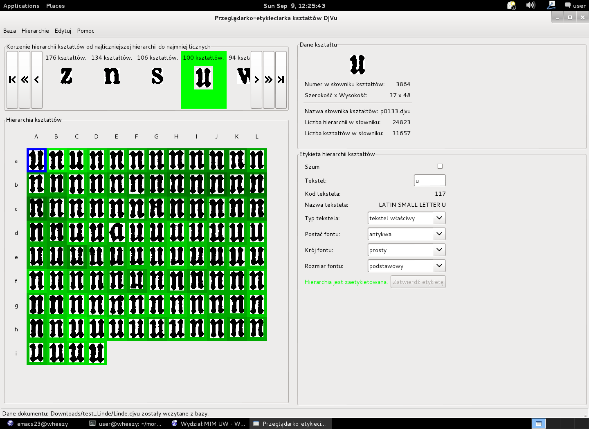

# DjVu_shape_labeller
A meta-repository for a suit of tools
## Components

- [`revealshapes`](https://github.com/jsbien/revealshapes): Extracts shape and page metadata from DjVu files.
- [`labelshapes`](https://github.com/jsbien/labelshapes) (not yet available): Interactive labeling and database integration.
- Shared documentation (in `docs/`, not yet available).

## History

The development of the original experimental version of the tools was
supported by the Ministry of Science and Higher Education's grant
no. N N519 384036 [Digitization tools for philological
research](https://github.com/jsbien/ndt/wiki/wyniki) directed by
[Janusz S. Bień](https://orcid.org/0000-0001-5006-8183) in years
2009-2012; he formulated also the conception of the DjVu shape
labelling tools. The conception was implemented by Piotr Sikora,
cf. https://bitbucket.org/piotr_sikora/djvulibre-shape-tools and
https://github.com/jsbien/psikora-moredjvushapetools/.

## A simulated user sessions:

**Figure 1** — Unlabeled shape tree  

**Figure 2** — Assigning main shape label (‘u’)  

**Figure 3** — Confirming main shape label  

**Figure 4** — Removing a subtree with incorrect shapes (‘n’)  

**Figure 5** — Result of subtree removal  

**Figure 6** — Removing a single incorrect shape (‘n’)  

**Figure 7** — Result of removal, next incorrect shape marked (‘a’)  

**Figure 8** — Removing the incorrect shape (‘a’)  

**Figure 9** — Result of removing shape ‘a’  

**Figure 10** — Removing another incorrect subtree (‘n’)  

**Figure 11** — Removing another incorrect subtree (‘n’)  

**Figure 12** — Marking another subtree for removal (‘n’)  

**Figure 13** — Final shape tree containing only the letter ‘u’  

